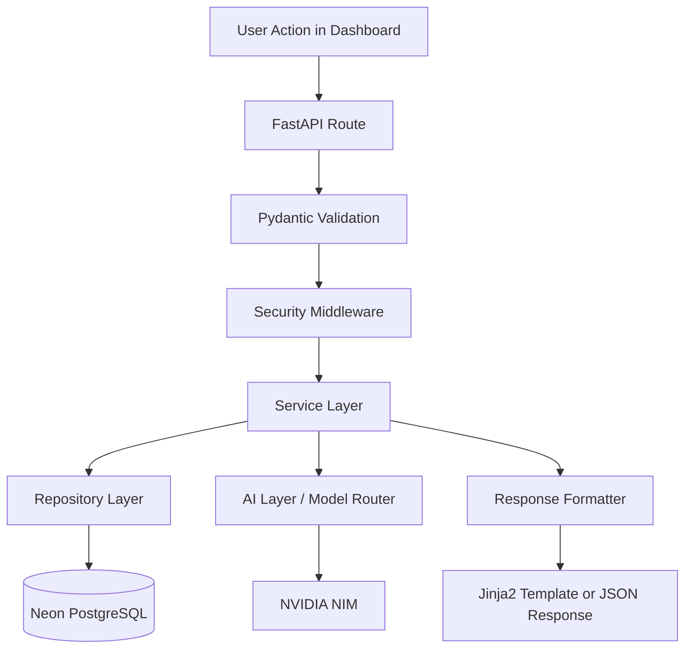
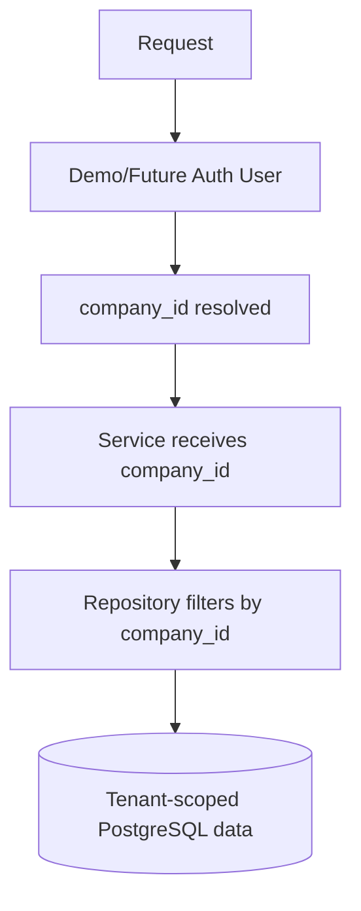
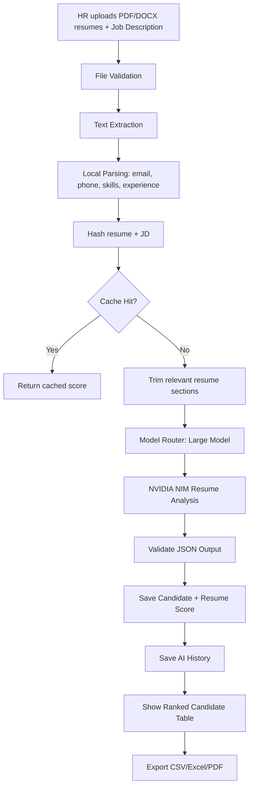
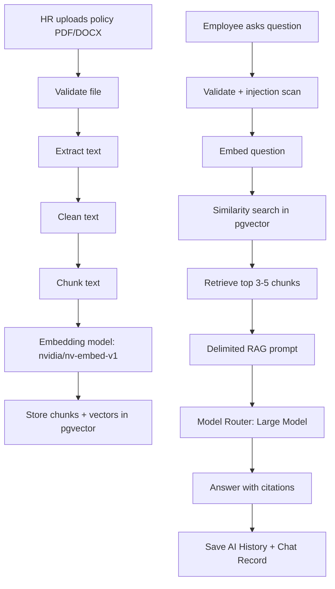
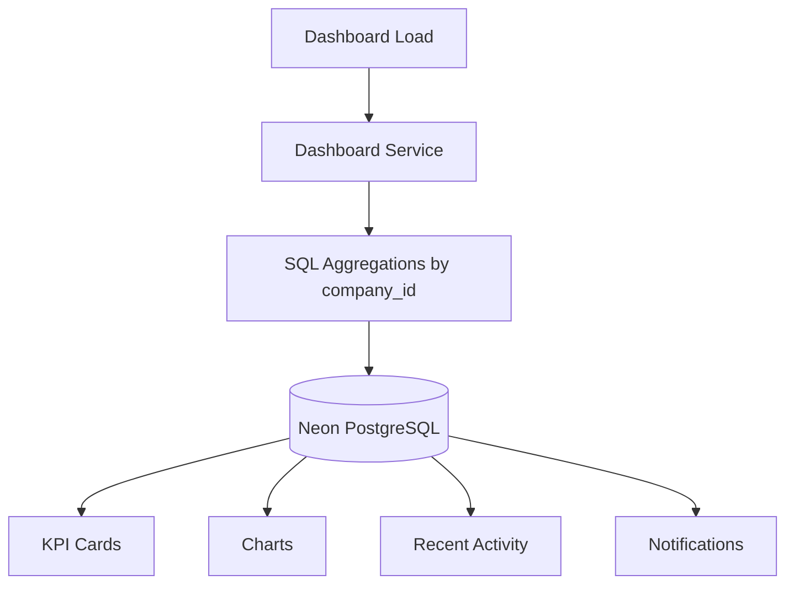

# TalentForge AI — Data Flow Documentation

## Purpose
This document explains how data moves through TalentForge AI across all major workflows.

TalentForge AI is a multi-tenant HR SaaS platform. Every tenant-owned workflow must preserve `company_id` isolation from request entry to database query, AI processing, export generation, and dashboard analytics.

## Global Request Flow

## Tenant Data Flow

Rules:

- Every tenant-owned query must filter by `company_id`.
- No service may fetch tenant data without receiving `company_id`.
- Authentication and RBAC are deferred until after all 8 core modules work. For V1, use demo-user/current-company architecture only. All services and repositories must accept company_id so JWT/RBAC can be added later without refactor.

## Resume Screening Flow

Important rules:

- Never send full resumes to the LLM.
- AI output must include score, explanation, matching skills, missing skills, and recommendation.
- Every hiring recommendation must show human review required.

## HR Policy RAG Flow

Rules:

- RAG is used only for HR policy documents.
- Always cite document name and page/section.
- If context does not contain the answer, say it was not found and suggest contacting HR.

## Other Module Flows

### Job Description Generator

HR input → validation → normalize role/skills → cache check → small model → validate output → save JD → save AI history → export.

### Onboarding Assistant

New hire input → validation → small model → onboarding plan → save plan/tasks → save AI history → local progress tracking.

### Performance Review

Review input → validation → local goal calculation → large model → review draft + bias check → save review → save AI history → human review warning.

### Attrition Prediction

Employee risk input → validation → local ML/rule-based score → save risk explanation → high/critical check → large model retention strategy only when needed → save AI history.

### Learning Recommendation

Skill input → validation → local skill gap preprocessing → large model → learning plan → save AI history → training tracking.

### Interview Kit Generator

Role/skills input → validation → cache check → small model → interview kit → save AI history → export PDF/DOCX.

## Dashboard Data Flow

Rules:

- Dashboard analytics must come from SQL/Pandas, not AI.
- Dashboard must show demo data immediately after seeding.

## Export Data Flow

User clicks export → validate export type → fetch tenant-scoped data → generate file server-side → save export metadata → return download response.

Allowed formats: PDF, CSV, Excel, DOCX, TXT.

## AI History Flow

AI request → model router → NVIDIA NIM → validate output → save AI history → return output.

Every AI history record must store company_id, module name, task type, model used, prompt hash, input summary, output, cache status, latency, and created_at.

Never store full sensitive raw input in AI history.
